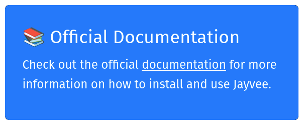

<!--
SPDX-FileCopyrightText: 2023 Friedrich-Alexander-Universitat Erlangen-Nurnberg

SPDX-License-Identifier: AGPL-3.0-only
-->

# Jayvee

Jayvee is a domain-specific language (DSL) for automated processing of data pipelines.
The Jayvee interpreter allows executing such data pipelines on local machines.
Data engineers can use Jayvee and its interpreter to clean and preprocess data for later activities like data science or machine learning.

[](https://jvalue.github.io/jayvee)

## Contribute

In case you would like to contribute to Jayvee, please have a look at our [contribution guide](CONTRIBUTING.md).

## Development Quickstart

1. Run `npm ci` to install the dependencies.
2. Run `npm run generate` to generate TypeScript code from the Jayvee grammar definition and the standard library.
3. Run `npm run build` to compile all projects.
4. In Visual Studio Code, press `F5` to open a new window with the Jayvee extension loaded.
5. Create a new file with a `.jv` file name suffix or open an existing file in the directory `example`.
6. Verify that syntax highlighting, validation, completion etc. are working as expected.
7. Run `node dist/apps/interpreter/main.js` to see options for the CLI of the interpreter; `node dist/apps/interpreter/main.js <file>` interprets a given `.jv` file.

In case you run into problems, make sure to use the current LTS version of Node.js and npm.

## Projects overview

| Name                                                              | Description                                                                                                                      | NPM package                                                                                                          |
| ----------------------------------------------------------------- | -------------------------------------------------------------------------------------------------------------------------------- | -------------------------------------------------------------------------------------------------------------------- |
| [`language-server`](./libs/language-server)                       | Jayvee language definition and language server implementation                                                                    | [@jvalue/jayvee-language-server](https://www.npmjs.com/package/@jvalue/jayvee-language-server)                       |
| [`interpreter`](./apps/interpreter)                               | Command line tool for interpreting Jayvee files                                                                                  | [@jvalue/jayvee-interpreter](https://www.npmjs.com/package/@jvalue/jayvee-interpreter)                               |
| [`language-server-web-worker`](./apps/language-server-web-worker) | Ready-to-use Jayvee language server, bundled as a [Web Worker](https://developer.mozilla.org/en-US/docs/Web/API/Web_Workers_API) | [@jvalue/jayvee-language-server-web-worker](https://www.npmjs.com/package/@jvalue/jayvee-language-server-web-worker) |
| [`vs-code-extension`](./apps/vs-code-extension)                   | Visual Studio Code extension for editing Jayvee files                                                                            | -                                                                                                                    |
| [`docs`](./apps/docs)                                             | Website for Jayvee user documentation                                                                                            | -                                                                                                                    |
| [`monaco-editor`](./libs/monaco-editor)                           | React component for editing Jayvee files                                                                                         | [@jvalue/jayvee-monaco](https://www.npmjs.com/package/@jvalue/jayvee-monaco)                                         |
| [`execution`](./libs/execution)                                   | Shared code for Jayvee extensions and the interpreter                                                                            | -                                                                                                                    |
| [`extensions/std`](./libs/extensions/std)                         | Standard Jayvee extension consisting of the extensions below                                                                     | -                                                                                                                    |
| [`extensions/rdbms`](./libs/extensions/rdbms)                     | Jayvee extension for relational databases                                                                                        | -                                                                                                                    |
| [`extensions/tabular`](./libs/extensions/tabular)                 | Jayvee extension for tabular data                                                                                                | -                                                                                                                    |

## Scripts

### Building all projects

```bash
npm run build
```

### Linting all projects

```bash
npm run lint
```

### Formatting project files via Nx

```bash
npm run format
```

### Testing all projects

```bash
npm run test
```

### Generating TypeScript code from the grammar definition

```bash
npm run generate
```

### Examples

#### Load data about cars into a local SQLite DB

```bash
npm run example:cars
```

#### Load GTFS data into a local SQLite DB

```bash
npm run example:gtfs
```

#### Load data about electric vehicles into local Postgres and SQLite DBs

1. Start the Postgres database locally

```bash
docker compose -f ./example/docker-compose.example.yml up
```

2. Run the Jayvee model

```bash
npm run example:vehicles
```
