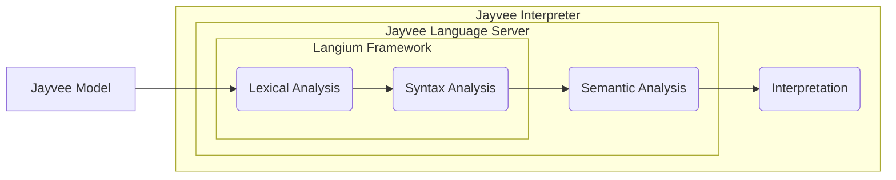

Jayvee has a clear separation between the language itself and its execution.
This guides the overall architecture as you will notice in the next sections.

## Language Server

On the pure language side, there is the [language server](https://github.com/jvalue/jayvee/tree/main/libs/language-server) which is heavily built upon the [Langium framework](https://langium.org/).
It contains the syntax definition (i.e. the grammar) and is capable of performing static semantic analysis on models, so invalid models can be rejected and errors are reported to the user.
It uses the [Language Server Protocol](https://microsoft.github.io/language-server-protocol/) (LSP) for communicating with IDEs in order to provide common features such as diagnostics, auto completion and much more.

## Interpreter

The Jayvee [interpreter](https://github.com/jvalue/jayvee/tree/main/apps/interpreter) on the other hand is capable of running Jayvee models.
Therefore, it uses the language server as a library to perform lexing, parsing and semantic analysis on given models.
In case no errors were found during these phases, it executes the model by interpreting it.
This means that models are not compiled to any other language, like a compiler does, but rather directly executed on the fly without any code generation involved.
The interpreter comes with a command-line interface (CLI) for users, so they are able to execute Jayvee models easily.

The following diagram gives an overview of the structure described so far:

## Jayvee Extensions

Lastly, there are Jayvee extensions for adding additional features to the language.
See [here](./05-jayvee-extensions.md) for more details.
You will notice that extensions also follow the separation described above.
