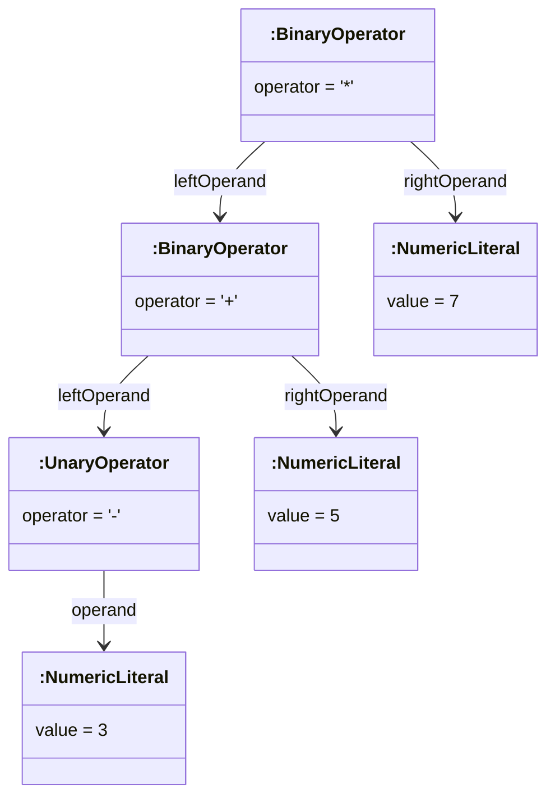
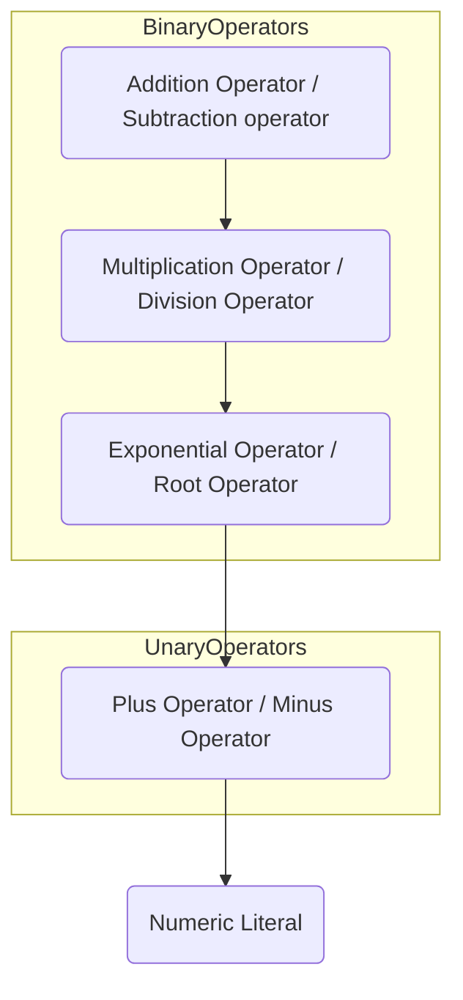

Jayvee supports arbitrarily nested expressions and offers a variety of different operators.
Such expressions are similar to those used in programming languages, and they are intended to be read and understood intuitively.

The following sections explain the definition of expressions in the language grammar, their type inference mechanism, and how the evaluation of expressions works.
As a small practical example, you may also have a look at the [arithmetics example by Langium](https://github.com/langium/langium/tree/main/examples/arithmetics) which has a heavy focus on mathematical expressions and functions.

## Expressions in the grammar

Expressions in the Jayvee grammar are defined in [`expression.langium`](https://github.com/jvalue/jayvee/blob/main/libs/language-server/src/grammar/expression.langium) and consist of operators (unary / binary / ternary) and literals.
Unary operators only have a single operand (e.g. the `not` operator), binary operators require two operands (e.g. the `*` operator) and ternary operators require three operands.

The grammar is written in a way that literals end up in the leaves of the resulting AST and the nodes above represent the operators.

As an example, have a look at the following AST structure of the expression `(-3 + 5) * 7`:

The AST is constructed in a way that ensures an unambiguous evaluation order when using depth-first search.
This implies that the AST structure already reflects the precedence and associativity of the operators, and that parentheses do not need to be explicitly represented.

For more details on how such a grammar for expressions can be realized, see the [official Langium documentation](https://langium.org/docs/grammar-language/#tree-rewriting-actions), [this blog post](https://www.typefox.io/blog/parsing-expressions-with-xtext) and the following two sections which discuss the precedence and associativity of operators.

### Precedence of operators

The grammar implicitly defines the precedence of operators.
The operator precedence defines the order in which operators are evaluated within an expression.
For example, multiplication has a higher precedence than addition, which leads to multiplications being performed before additions.
In order to manually override such precedence conventions, parentheses can be used in expressions.

The diagram below shows a more extensive precedence hierarchy, focused on common arithmetic operators.
Note that the hierarchy is arranged in ascending order, according to the operator precedence.
Such an order is similar to how operators in the actual Jayvee grammar are arranged:

In the Jayvee grammar, every level of precedence is represented by a single grammar rule.
Within each such rule, the grammar rule which defines the operators with the next higher precedence is referenced.
E.g. the `AdditiveExpression` rule refers to the `MultiplicativeExpression` rule because multiplicative operators are supposed to have the next higher precedence.

In order to alter the precedence of operators, their hierarchy of grammar rules has to be adjusted accordingly in [`expression.langium`](https://github.com/jvalue/jayvee/blob/main/libs/language-server/src/grammar/expression.langium).

### Associativity of operators

The associativity of operators defines the order in which operators with the same precedence are evaluated when they appear in succession without parentheses.
Operators may be either **left-associative**, **right-associative** or **non-associative**.
For example, depending on the associativity of the binary `+` operator, the expression `a + b + c` has different semantics:

- Left-associative: `(a + b) + c` (evaluation from left to right)
- Right-associative: `a + (b + c)` (evaluation from right to left)
- Non-associative: _syntax error_, the operator cannot be chained

The associativity of operators is also defined in the Jayvee grammar, more specifically by the structure of the grammar rules that define operators.
For details on how to encode the different kinds of associativity in grammar rules, have a look at the "Associativity" section near the end of [this blog post](https://www.typefox.io/blog/parsing-expressions-with-xtext).
The patterns described in the linked article can be found in [`expression.langium`](https://github.com/jvalue/jayvee/blob/main/libs/language-server/src/grammar/expression.langium), so each operator grammar rule encodes its own associativity.

## Typing of expressions

Jayvee has a mechanism for inferring and validating the type of a given expression.
This is achieved using a recursive algorithm which performs depth-first search on a given expression:

The base case for the algorithm are literals, i.e. the tree leaves of an expression.
Depending on the type of literal, their type can be inferred trivially (in case of value literals) or otherwise from the context where the expression is located.

For operators, the types of their operands are first inferred via recursion, and then it is checked whether they are supported by the operator.
Next, given the operand types, the resulting type is computed.
Such behavior is defined in a _type computer class_ located [here](https://github.com/jvalue/jayvee/tree/main/libs/language-server/src/lib/ast/expressions/type-computers).
Additionally, in [`operator-registry.ts`](https://github.com/jvalue/jayvee/blob/main/libs/language-server/src/lib/ast/expressions/operator-registry.ts), a type computer is registered for each kind of operator.

In case the algorithm fails to infer a type, e.g. due to unsupported operand types or unresolved references in literals, the resulting type is `undefined`.
In order to report diagnostics in such cases, a `ValidationContext` object can be supplied when calling the type inference.

## Evaluation of expressions

The evaluation has the purpose of computing a single value out of an expression.
For a successful evaluation, it is a **precondition** that **a type could successfully be inferred** from the respective expression.
Also, the **value for each free variable** in that expression (i.e. literals resembling placeholders for values) needs to be **known beforehand**.
Therefore, an `ExecutionContext` object is passed to the evaluation which holds values for free variables in the current context.

### Algorithm

The algorithm for evaluating expressions is also based on a recursive depth-first search, similar to how the type inference works:

Again, literals are the base case. A value literal trivially evaluates to its own value.
Other literals that resemble free variables evaluate to their value provided by the given `ExecutionContext` object.

Regarding operators, their operands first are evaluated recursively.
Next, using the concrete operand values, the operator computes its resulting value.
This is defined in operator evaluator classes located [here](https://github.com/jvalue/jayvee/tree/main/libs/language-server/src/lib/ast/expressions/evaluators).
The classes are registered in [operator-registry.ts](https://github.com/jvalue/jayvee/blob/main/libs/language-server/src/lib/ast/expressions/operator-registry.ts) for every operator, similar to the previously mentioned type computers.

The result of an evaluation may be `undefined` in case any errors occurred.
If the preconditions were all met, such errors are most likely arithmetic errors (like division by zero).
It is possible to provide a `ValidationContext` object to the evaluation for reporting such errors as diagnostics.

### Evaluation strategies

There are different evaluation strategies to choose from.
They affect the way, expressions are evaluated and thus have an impact on their semantics:

- `exhaustive`: A full depth-first search is performed, all parts of an expression are evaluated.
- `lazy`: An evaluation with the least effort is performed. Logical operators use [short circuit semantics](https://en.wikipedia.org/wiki/Short-circuit_evaluation) and binary operators don't evaluate their right operand if the left one evaluated to `undefined`.
