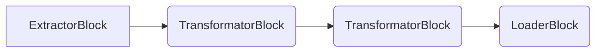

# Core Concepts

The core concepts of Jayvee are `Pipelines`, `Blocks`, and `ValueTypes`.

## Pipelines

A `Pipeline` is a sequence of different computing steps, the `Blocks`.
The default output of a block becomes the default input of the next block, building a chain of computing steps.
In the scope of a `Pipeline`, you can connect these blocks via the `pipe` syntax:

```jayvee
pipeline CarsPipeline {
    // Assumption: blocks "GasReserveHttpExtractor", "GasReserveCSVInterpreter", "GasReserveTableInterpreter", and "GasReserveLoader" are defined

    GasReserveHttpExtractor
		-> GasReserveTextFileInterpreter
		-> GasReserveCSVInterpreter
		-> GasReserveTableInterpreter
		-> GasReserveLoader;
}
```

Alternatively, you can use a slightly longer syntax for pipes:

```jayvee
pipeline CarsPipeline {
    // Assumption: blocks "GasReserveHttpExtractor", "GasReserveCSVInterpreter", "GasReserveTableInterpreter", and "GasReserveLoader" are defined

    pipe {
        from: GasReserveHttpExtractor;
        to: GasReserveTextFileInterpreter;

    }

    pipe {
        from: GasReserveTextFileInterpreter;
        to: GasReserveCSVInterpreter;

    }

    // etc.
}
```

## Blocks

A `Block` is a processing step within a `Pipeline`.
It can have a default input and a default output.
We differentiate the following types of `Blocks`:
- `ExtractorBlocks` do not have a default input but only a default output. They model a **data source**.
- `TransformatorBlocks` have a default input and a default output. They model a **transformation**.
- `LoaderBlocks` do have a default input but nor a default output. They model a **data sink**.

The general structure of a `Pipeline` consisting of different blocks is the following:



The common syntax of blocks is at its core a key-value map to provide configuration to the block.
The availability of property keys and their respective `ValueTypes` is determined by the type of the `Block` - indicated by the identifier after the keyword `oftype`:

```jayvee
block GasReserveHttpExtractor oftype HttpExtractor {
    // key: value
    url: "https://www.bundesnetzagentur.de/_tools/SVG/js2/_functions/csv_export.html?view=renderCSV&id=1089590";
} 
```

In the example above, the `url` property of type `text` is defined by the corresponding `HttpExtractor` block type.

## ValueTypes

A `ValueType` is the definition of a data type of the processed data.
Some `Blocks` use `ValueTypes` to define logic (like filtering or assessing the data type in a data sink).
We differentiate the following types of `ValueTypes`:
- `Built-in ValueTypes` come with the basic version of Jayvee.
  Currently `text`, `decimal`, `integer`, and `boolean` are supported.
- `Primitive ValueTypes` can be defined by the user to model domain-specific data types and represent a single value.
  `Constraints` can be added to a `Primitive ValueType` (see [below](#constraints)).
- `Compound ValueTypes`: UPCOMING.

### Constraints

`Constraints` for `ValueTypes` declare the validity criteria that each concrete value is checked against.
The syntax of `Constraints` is similar to the syntax of `Blocks`.
The availability of property keys and their respective `ValueTypes` is determined by the type of the `Constraint` - indicated by the identifier after the keyword `oftype`:

```jayvee
constraint GasFillLevelRange oftype RangeConstraint {
    lowerBound: 0;
    lowerBoundInclusive: true;
    upperBound: 100;
    upperBoundInclusive: true;
}
```

Note that the type of `Constraint` also determines its applicability to `ValueTypes`.
For instance, a `RangeConstraint` can only be applied to the numerical types `integer` and `decimal`.

### Primitive ValueTypes

`Primitive ValueTypes` are based on `Built-in ValueTypes` and use a collection of constraints to restrict the range of valid values.
Such constraints are implicitly connected via a logical `AND` relation.
Note that the `Constraints` need to be applicable to the base-type of the `ValueType` - indicated by the identifier after the keyword `oftype`:

```jayvee
valuetype GasFillLevel oftype integer {
    constraints: [ GasFillLevelRange ];
}
```

### Transforms
`Transforms` are used to transform data from one `ValueType` to a different one. For more details, see [Transforms](./transforms.md)