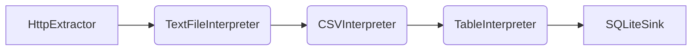
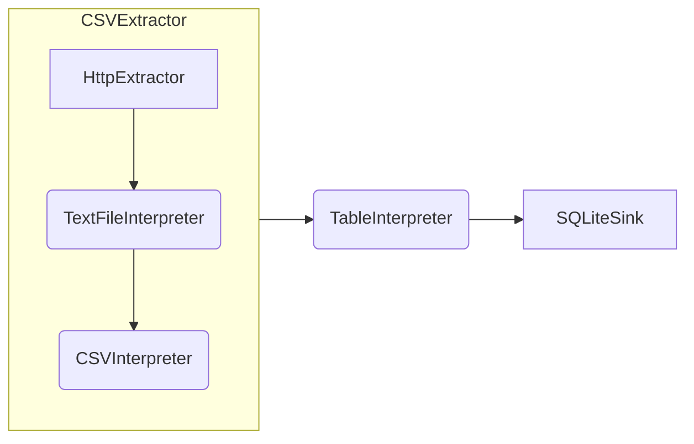

# Composite Blocks

Composite blocks are a way to create new blocktypes in Jayvee by combining the functionality of existing blocks and pipes. By relying on composite blocks instead of implementing more builtin blocks in a language interpreter, Jayvee supports easy extension by users.

Composite blocks define:
- with the `property` keyword: properties with a name and [value type](./core-concepts.md#valuetypes), optionally a default value
- with the `input` keyword: one input with a name and io type (that can be None)
- with the `output` keyword: one output with a name and io type (that can be None)
- one pipeline definition, starting from the input (using its name) and ending in the output (again using its name)
- all blocks that are used in the pipeline definition (either builtin or other composite blocks)

## Example
As an example, the common use-case of extracting a CSV file from a webserver using HTTP. With builtin blocks, a pipeline would start with a HttpExtractor source that downloads a file from the internet and outputs a binary file. This file must be interpreted as text (using a TextFileInterpreter) and finally as Sheet (using a CSVInterpreter). 

### Implementation with builtin blocks


A pipeline with builtin blocks is very verbose:

```jayvee
pipeline CarsPipeline {
	CarsExtractor
        -> CarsTextFileInterpreter
	    -> CarsCSVInterpreter 
	   	-> CarsTableInterpreter
		-> CarsLoader;

	block CarsExtractor oftype HttpExtractor {
		url: "https://example.com/cars.csv";
	}

	block CarsTextFileInterpreter oftype TextFileInterpreter { }

	block CarsCSVInterpreter oftype CSVInterpreter {
		enclosing: '"';
	}
    // ... further block definitions
}
```

### Refactoring using composite blocks

The common use-case of downloading a CSV file using HTTP can be refactored into a composite block. Note that we define all properties of the builtin blocks that are used as properties of the new CSVExtractor blocktype (but add fallback values). If some internal configuration is always the same, we could also not expose it as a property of the new blocktype.

```jayvee
// Define a new blocktype named CSVExtractor outside of the pipeline
composite blocktype CSVExtractor {
    // Properties of the CSVExtractor, some with default values
    property url oftype text;
    property delimiter oftype text: ',';
    property enclosing oftype text: '';
    property enclosingEscape oftype text: '';

    // Input and outputs
    input inputName oftype None;
    output outputName oftype Sheet;

    // Pipeline definition from input, over blocks defined later, to output
    inputName
        ->FileExtractor
        ->FileTextInterpreter
        ->FileCSVInterpreter
        ->outputName;

    // Block definitions using values from properties by name
    block FileExtractor oftype HttpExtractor { url: url; }
    block FileTextInterpreter oftype TextFileInterpreter {}

	block FileCSVInterpreter oftype CSVInterpreter {
		delimiter: delimiter;
		enclosing: enclosing;
		enclosingEscape: enclosingEscape;
	}
}
```

With the new CSVExtractor composite blocktype, the pipeline now looks like this.



If the CSVExtractor is available in the scope of the `CarsPipeline` from before (e.g., by defining it above the pipeline), it can then be used to shorten the actual pipeline code.

```jayvee
pipeline CarsPipeline {
    // HttpExtractor, TextFileInterpreter and CSVInterpreter have been replaced by CSVExtractor
    CarsExtractor
        -> CarsTableInterpreter
        -> CarsLoader;

    block CarsExtractor oftype CSVExtractor {
        url: "https://example.com/cars.csv";
    }

    // ... further block definitions
}
```