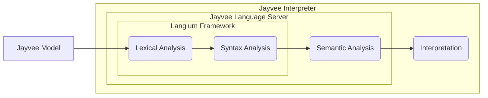

Jayvee has a clear separation between the language itself and its execution.
This guide gives an overview of the overall architecture.

## Language Server

On the pure language side, the central project is the [language server](https://github.com/jvalue/jayvee/tree/main/libs/language-server) which is heavily built upon the [Langium framework](https://langium.org/).
It contains the syntax definition (i.e. the grammar) and is capable of performing static semantic analysis on models, so invalid models can be rejected and errors are reported to the user.
It uses the [Language Server Protocol](https://microsoft.github.io/language-server-protocol/) (LSP) for communicating with IDEs in order to provide common features such as diagnostics, auto completion and much more.

**Note:** The [Langium framework](https://langium.org/) generate TypeScript files for the abstract syntax tree (AST), based on the grammar specification.
The following locations might be especially helpful to understand the grammar and its AST:

- The Langium grammar files (see [here](https://github.com/jvalue/jayvee/tree/main/libs/language-server/src/grammar) or locally at `libs/language-server/src/grammar`; with `.langium` file ending). These files define the **syntax of the language**.
- The generated TypeScript AST files (execute `npm run generate` to generate them at `libs/language-server/src/lib/ast/generated` in your local repository). These files include **TypeScript interfaces for AST nodes** (e.g., `BlockDefinition`) and **guard methods** (e.g., `isBlockDefinition`).
  They reflect the input of the grammar files regarding naming.
- The remaining source files of the language server implement the language server protocol (LSP) and the additional validations beyond the syntax of Jayvee.

## Interpreter

The Jayvee [interpreter](https://github.com/jvalue/jayvee/tree/main/apps/interpreter) on the other hand is capable of running Jayvee models.
Therefore, it uses the language server as a library to perform lexing, parsing and semantic analysis on given models.
In case no errors were found during these phases, it executes the model by interpreting it.
This means that models are not compiled to any other language, like a compiler does, but rather directly executed on the fly without any code generation involved.
The interpreter comes with a command-line interface (CLI) for users, so they are able to execute Jayvee models easily.

The following diagram visualizes the architecture described so far:

## Jayvee Extensions

Lastly, there are Jayvee extensions for adding additional features to Jayvee.
See [here](./04-guides/06-jayvee-extensions.md) for more details.
It is worth pointing out that extensions also follow the separation between language and execution described above.
