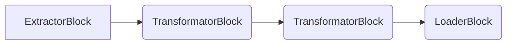

# Core Concepts

The core concepts of Jayvee are _pipelines_, _blocks_, and _value types_.

## Pipelines

A _pipeline_ is a sequence of different computing steps, the _blocks_.
The default output of a _block_ becomes the default input of the next _block_, building a chain of computing steps.
In the scope of a _pipeline_, you can connect these _blocks_ via the _pipe_ syntax:

```jayvee
pipeline CarsPipeline {
    // Assumption: blocks "GasReserveHttpExtractor", "GasReserveCSVInterpreter", "GasReserveTableInterpreter", and "GasReserveLoader" are defined

    GasReserveHttpExtractor
		-> GasReserveTextFileInterpreter
		-> GasReserveCSVInterpreter
		-> GasReserveTableInterpreter
		-> GasReserveLoader;
}
```

## Blocks

A _block_ is a processing step within a _pipeline_.
It can have a default input and a default output.
We differentiate the following types of _blocks_:

- _Extractor blocks_ do not have a default input but only a default output. They model a **data source**.
- _Transformator blocks_ have a default input and a default output. They model a **transformation**.
- _Loader blocks_ do have a default input but nor a default output. They model a **data sink**.

The general structure of a _pipeline_ consisting of different blocks is the following:



The common syntax of _blocks_ is at its core a key-value map to provide configuration to the _block_.
The availability of property keys and their respective _value types_ is determined by the type of the _block_, called _block type_ - indicated by the identifier after the keyword `oftype`:

```jayvee
block GasReserveHttpExtractor oftype HttpExtractor {
    // key: value
    url: "https://www.bundesnetzagentur.de/_tools/SVG/js2/_functions/csv_export.html?view=renderCSV&id=1089590";
}
```

In the example above, the `url` property of type `text` is defined by the corresponding `HttpExtractor` _block type_.

_Blocks_ can be either defined as part of the language, called _built-in_ or defined as composition of existing _blocks_ by users in Jayvee, called _composite block types_. See the documentation for [_composite block types_](./composite-block-types.md).

## Value types

A _value type_ is the definition of a data type of the processed data.
Some _blocks_ use _value types_ to define logic (like filtering or assessing the data type in a data sink).
We differentiate the following kinds of _value types_:

- _Built-in value types_ come with the basic version of Jayvee. See [built-in value types](./value-types/built-in-value-types).
- _Primitive value types_ can be defined by the user to model domain-specific data types and represent a single value.
  _Constraints_ can be added to a _primitive value types_.
  See [primitive value types](./value-types/primitive-value-types).
- _Compound value types_: UPCOMING.

```jayvee
valuetype GasFillLevel oftype integer {
    constraints: [ GasFillLevelRange ];
}

constraint GasFillLevelRange on decimal:
    value >= 0 and value <= 100;
```

## Transforms

_Transforms_ are used to transform data from one _value type_ to a different one. For more details, see [transforms](./transforms.md).

```jayvee
transform CelsiusToKelvin {
  from tempCelsius oftype decimal;
  to tempKelvin oftype decimal;

  tempKelvin: tempCelsius + 273.15;
}
```

## Publishing / using model elements

If you want to use a model element in a different file other than the one you define it, you need to _publish_ and _use_ it.

1. Publish the element to make it usable in other files.

```jayvee
// Either publish right away when defining an element
publish constraint GasFillLevelRange on decimal:
    value >= 0 and value <= 100;

// Or define first and publish separately
constraint GasFillLevelRange on decimal:
    value >= 0 and value <= 100;

publish GasFillLevelRange;
publish GasFillLevelRange as PercentGasFillLevel; // Alias for renaming the published element
```

2. Use the element in another file

```jayvee
// Define from where you want to take elements

// Wildcard "*" makes all published elements of the file available
use * from './relative/path/to/file.jv';

// Named use only makes the named elements available
use { GasFillLevelRange } './relative/path/to/file.jv';
use { GasFillLevelRange as FillLevelRange } './relative/path/to/file.jv'; // Alias locally renames elements


// Then just use them as if they were defined on root level

valuetype GasFillLevel oftype integer {
    constraints: [ GasFillLevelRange ]; // GasFillLevelRange is defined in another file
}
```

Currently, only root-level elements can be published, so elements defined within a pipeline cannot be used in other files.
