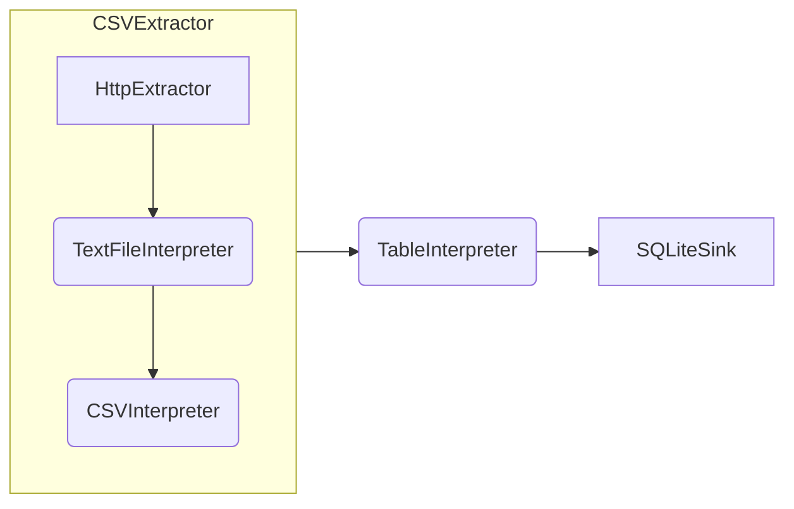

# Composite Block Types

_Composite block types_ are a way to create new _block types_ in Jayvee by combining the functionality of existing _blocks_ and _pipes_. By relying on _composite block types_ instead of implementing more _built-in block types_ in a language interpreter, Jayvee supports easy extension by users.

_Composite block types_ define:

- with the `property` keyword: properties with a name and [value type](<./core-concepts.md#value types>), optionally a default value
- with the `input` keyword: one input with a name and _io type_ (that can be `None`)
- with the `output` keyword: one output with a name and _io type_ (that can be `None`)
- one _pipeline_ definition, starting from the input (using its name) and ending in the output (again using its name)
- all _blocks_ that are used in the _pipeline_ definition (either _blocks_ of _built-in_ or _composite block types_)

## Example

As an example, the common use-case of extracting a CSV file from a web server using HTTP. With _built-in block types_, a _pipeline_ would start with a `HttpExtractor` source that downloads a file from the internet and outputs a binary file. This file must be interpreted as text (using a `TextFileInterpreter`) and finally as `Sheet` (using a `CSVInterpreter`).

### Implementation with built-in block types


A _pipeline_ with _blocks_ using _built-in block types_ is very verbose:

```jayvee
pipeline CarsPipeline {
	CarsExtractor
        -> CarsTextFileInterpreter
	    -> CarsCSVInterpreter
	   	-> CarsTableInterpreter
		-> CarsLoader;

	block CarsExtractor oftype HttpExtractor {
		url: "https://example.com/cars.csv";
	}

	block CarsTextFileInterpreter oftype TextFileInterpreter { }

	block CarsCSVInterpreter oftype CSVInterpreter {
		enclosing: '"';
	}
    // ... further block definitions
}
```

### Refactoring using composite block types

The common use-case of downloading a CSV file using HTTP can be refactored into a _composite block type_. Note that we define all properties of the _built-in blocks_ that are used as properties of the new `CSVExtractor` _block type_ (but add fallback values). If some internal configuration is always the same, we could also not expose it as a property of the new _block type_.

```jayvee
// Define a new composite block type named CSVExtractor outside of the pipeline
composite blocktype CSVExtractor {
    // Properties of the CSVExtractor, some with default values
    property url oftype text;
    property delimiter oftype text: ',';
    property enclosing oftype text: '';
    property enclosingEscape oftype text: '';

    // Input and outputs
    input inputName oftype None;
    output outputName oftype Sheet;

    // Pipeline definition from input, over blocks defined later, to output
    inputName
        ->FileExtractor
        ->FileTextInterpreter
        ->FileCSVInterpreter
        ->outputName;

    // Block definitions using values from properties by name
    block FileExtractor oftype HttpExtractor { url: url; }
    block FileTextInterpreter oftype TextFileInterpreter {}

	block FileCSVInterpreter oftype CSVInterpreter {
		delimiter: delimiter;
		enclosing: enclosing;
		enclosingEscape: enclosingEscape;
	}
}
```

With the new `CSVExtractor` _composite block type_, the _pipeline_ now looks like this.



If the `CSVExtractor` is available in the scope of the `CarsPipeline` from before (e.g., by defining it above the _pipeline_), it can then be used to shorten the actual _pipeline_ code.

```jayvee
pipeline CarsPipeline {
    // HttpExtractor, TextFileInterpreter and CSVInterpreter have been replaced by CSVExtractor
    CarsExtractor
        -> CarsTableInterpreter
        -> CarsLoader;

    block CarsExtractor oftype CSVExtractor {
        url: "https://example.com/cars.csv";
    }

    // ... further block definitions
}
```
