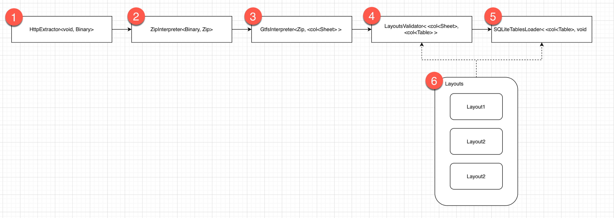

Feature Name: gtfs-extension

Disclaimer: This RFC is part of my master-thesis "Archiving open transport data using the JValue tooling ecosystem" supervised by @rhazn. I'll open an PR for that, in order to discuss the neccessary changes to Jayvee due to my implemenation.

# Summary
This RFC enables a pipeline extracting, validating and loading GTFS-data by providing an GTFS-endpoint under consideration of the [GTFS-speficiation](https://developers.google.com/transit/gtfs/reference). For that reason some changes and extensions of Jayvee have to be made. The overall goal of this RFC is processing GTFS-data with a minimun of changes/extensions in Jayvee. 

# Motivation
GTFS has gained widespread popularity over the past decade as an open-source industry standard for describing and publishing fixed- and dynamic route transit operations. It is a data standard that defines how public transit agencies can provide schedule information to developers. It is used by agencies around the world to publish their transit data in a common format, allowing developers to create applications that can access and use this data. GTFS data includes information about stops, routes, and schedules for buses, trains, and other forms of public transportation. GTFS-data is provided by an endpoint, which publishes a zip-file, consisting of a collection of comma-separated-values in plain text files. A example of a gtfs-zip-file could result in this datamodel (this visualization just includes required dimensions).


# Explanation
The following picture is a visualization of the corresponding [gtfs.jv](0002-gtfs.jv)-file. A GTFS-pipeline follows the overall pipeline pattern, consisting of an Extractor, some Interpreters, a Validator and finally a Loader to a sink (in our case all gtfs-csv-files are loaded into a SQLite database, each csv-file into its corresponding table). 


Jayvee needs to be extented by following parts to be able to process GTFS-data:
* New `io-datatypes` called `Binary`, `Zip` and `Collection<iodatatypes>`
* a bunch of new blocktypes `HTTPExtractor`, `ZipInterpreter`, `GTFSInterpreter`, `LayoutsValidator`, `SQLiteTablesLoader`
* a concept for processing collections of Sheets, Tables and Layouts

Each of the following subchapters explains the idea behind.

## 1) HttpExtractor
Input: void, Output: Binary

A HttpExtractors gets an Url, send an HTTP-GET-REQUEST to that URL and outputs the response as an binary type (eg. ArrayBuffer). This block can be used for getting any binary data of an HTTP-Endpoint.
```
block MyHttpExtractor oftype HttpExtractor {
    url: "https://www.data.gouv.fr/fr/datasets/r/c4d9326f-9f41-4dfb-9746-31bc97a31fc6";
}
```

## 2) ZipInterpreter
Input: Binary, Output: Zip

A ZipInterpreter gets an Binary type, and interpretes the ArrayBuffer as an zip-file. As it is not clear, what the zip-file contains, the unpacking of that zip-files takes places in the following GTFS-Interpreter, as GTFS specifies, that the zip-file must contain certain csv-files. Later on, the zip-unpacking could be refactored to an generic zip-unpacker.
```
block MyZipInterpreter oftype ZipInterpreter{
    tbd
}
```

## 3) GtfsInterpreter
Input: Zip, Output: Collection of Sheets

A GtfsInterpreter gets an zip-file, unpacks the zip-file and interprets every csv-file within the zip-file as a sheet. The output of that block is an collections of sheets. For that, we need a concept for handling collection of io-datatypes (in this case multiple sheets).
```
block MyGtfsInterpreter oftype GtfsInterpreter{
    tbd
}
```

## 4) LayoutsValidator
Input: Collection of Sheets, Output: Collection of Tables

A LayoutsValidator (Attention: here we talk about multiple Layouts) gets as input an collection of sheets and validates every sheet using a single, dedicated LayoutValidator (for a single layout). As an parameter the LayoutsValidator gets an mapping of filenames to layouts in order to be able to process multiple files/layouts within one block. Every sheet in the collection has its corresponding layout, wrapped in the layouts-block. After the validation of every sheet was sucessfull, the LayoutsValidator outputs a collection of validated tables.

```
block GtfsValidator oftype LayoutsValidator { 
		validationLayouts: gtfsLayouts;
}
```

### 4.1) Layout
As GTFS defines a whole datamodel consisting of multiple dimensions, we can provide (in some future) the user with a predefined set of layouts. Some columns in GTFS-csv-files are optional and conditional optional, what can be reflected in the grammar using ? and ! as an flag. From a generic perspective, these flags can be considered in every Validator, depending on the implementation, since optional columns could be in every csv-file not just in gtfs-csv-files. A vision is, that the GTFS-pipeline later on processes a list of GTFS-Endpoints. Because every endpoint has at least the required-columns, we need to have the optional-mechanism in our layout.
In a GTFS-Validator, some conditional (aka logical) checks could possibly be applied during the validation (not just a static header/datatype validaton, but later on an logical gtfs-validation as well). 

In the specifiation, the order of the columns are not defined, so we need to access the columns by their names, not their index as every GTFS-endpoint could possibly have a different order!! 

```
layout agencyLayout {
    header row 1: text;
    column agency_id!: text; //Conditional optional columns marked with !
    column agency_name: text;
    column agency_url: text;
    column agency_timezone: text;
    column agency_lang?: text; //Optional column marked with ?
    column agency_phone?: text; //Optional column marked with ?
    column agency_fare_url?: text; //Optional column marked with ? 
    column agency_email?: text; //Optional column marked with ?
}
```

Potentially, we need in future an optional-mechanism for whole layouts (not just columns) as well, since also some gtfs-dimensions are optional/conditional required. This is not part of this RFC right now, as my [.jv-file](0002-gtfs.jv) just consists of required dimensions. Could be extended later...

### 4.2) Layouts
As we want to process a zip-file containing multiple csv-files, we also need a mechanism to map csv-files to layouts. In my [.jv-file](0002-gtfs.jv), every layout gets defined as usual (header, column, datatypes --> please have look at chapter 4.1). Multiple layouts get then wrapped in a new grammar-feature, which maps csv-filenames to layouts. This layouts-artefact gets referenced by SQLiteTablesLoader and LayoutsValidator, too.
```
layouts gtfsLayouts {
    "agency": agencyLayout;
    "stops": stopsLayout;
    "routes": routesLayout;
    "trips": tripsLayout;
    "stop_times": stop_timesLayout;
    "calendar_dates": calendar_datesLayout;
    "feed_info": feed_infoLayout;
}
```
This mapping is later also used in the SQLiteTablesLoader, to define the output-table-names. The syntax for `layouts` is inspired by the MyTableBuilder-syntax from issue RFC for cell ranges #109

## 5) SQLiteTablesLoader
Input: Collection of Tables, Output: void

A SQLiteTablesLoader (Attention: here we talk about multiple SQLiteTables) gets as input an collection of tables. Every table gets then loaded to a corresponding SQLiteTable using the SQLiteLoader (for single table). The mapping is defined by the layouts-mapping as well.  

```
block GtfsLoader oftype SQLiteTablesLoader {
    tables: gtfsLayouts;
    file: "./gtfs.db";
}
```

