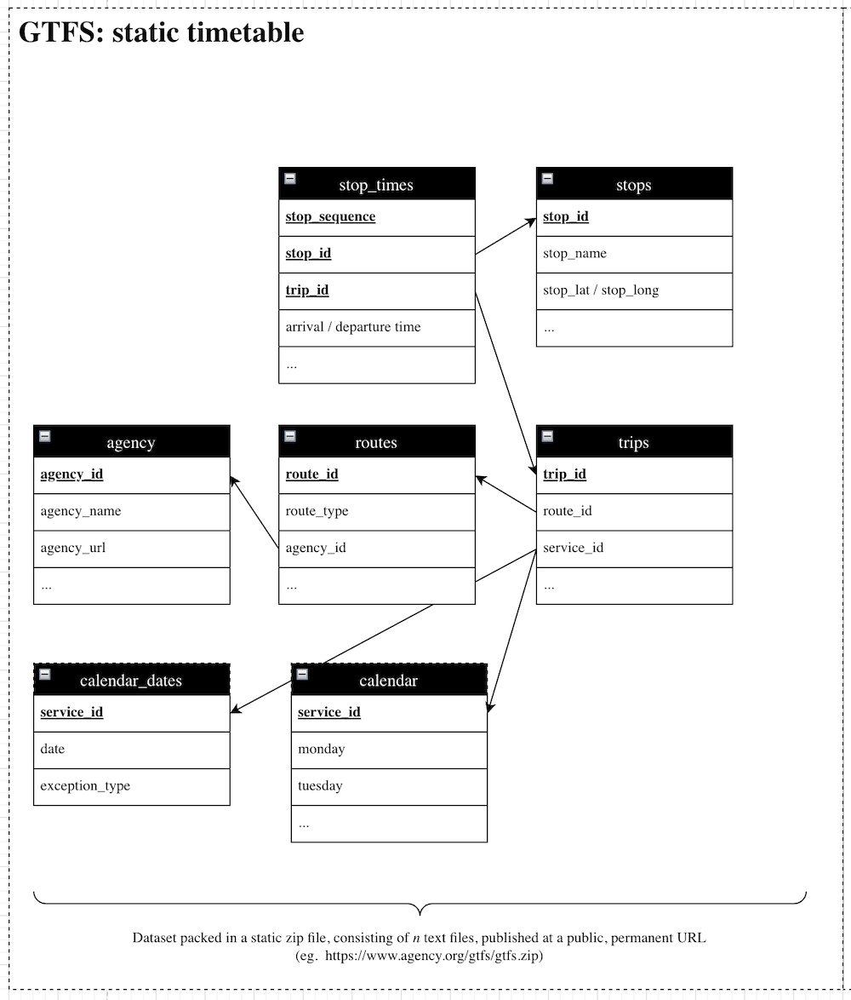
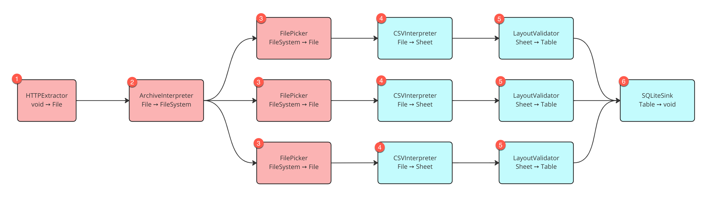

<!--
SPDX-FileCopyrightText: 2023 Friedrich-Alexander-Universitat Erlangen-Nurnberg

SPDX-License-Identifier: AGPL-3.0-only
-->

| | |
|---|---|
| Feature Tag | `mobility-extension` | 
| Status | `ACCEPTED` | <!-- Possible values: DRAFT, DISCUSSION, ACCEPTED, REJECTED -->
| Responsible | `@schlingling` |
| Implemented via | [#123](https://github.com/jvalue/jayvee/issues/123) |

Disclaimer: This RFC is part of my master-thesis "Archiving open transport data using the JValue tooling ecosystem" supervised by @rhazn.

# Summary
This RFC enables a pipeline extracting, validating and loading GTFS-data (part of domain mobility-data) by providing an GTFS-endpoint under consideration of the [GTFS-specification](https://developers.google.com/transit/gtfs/reference). For that reason some changes and extensions of Jayvee have to be made. The overall goal of this RFC is processing GTFS-data with a minimum of changes/extensions in Jayvee. 

# Motivation
GTFS has gained widespread popularity over the past decade as an open-source industry standard for describing and publishing fixed- and dynamic route transit operations. It is a data standard that defines how public transit agencies can provide schedule information to developers. It is used by agencies around the world to publish their transit data in a common format, allowing developers to create applications that can access and use this data. GTFS data includes information about stops, routes, and schedules for buses, trains, and other forms of public transportation. GTFS-data is provided by an endpoint, which publishes a zip-file, consisting of a collection of comma-separated-values in plain text files. A example of a gtfs-zip-file could result in this datamodel (this visualization just includes required dimensions).


# Explanation
The following picture is a visualization of the corresponding [example.jv](example.jv)-file. A GTFS-pipeline follows the overall pipeline pattern, consisting of an Extractor, some Interpreters, some Validators and finally a Loader to a sink (in our case all gtfs-csv-files are loaded into a SQLite database, each csv-file into its corresponding table). The individual GTFS files are picked out using their filename and further processed independently in parallel using block types that already exist (or at least in a similar form). In the image, there are three such parallel processing steps as an example. In practice, there would be one for each GTFS file in the ZIP archive. In case a file are not present, the further processing of that file is aborted and hence no table is created from that file. At the end, each successfully created table is loaded into the same SQLiteSink.



The red block types need to be created from scratch whereas the blue block types are either already present or only require minor changes (this classification is also reflected in the following chapter titles). 

Jayvee needs to be extented by following parts to be able to process GTFS-data:
* New `io-datatypes` called `File` and `FileSystem`
* New blocktypes `HTTPExtractor`, `ArchiveInterpreter` and `FilePicker`
* The  `io-datatype` `Table` needs to store its name to be able to handle multiple tables as input
* An abort-mechanism must be implemented, for that we need a new io-type `None` to abort, if a precessor outputs `None`

Each of the following subchapters explains the idea behind.

## New io-datatypes

### io-datatype File *(Requires implementation from scratch)*
A File datatype could look like this and should be added to `io-datatypes.ts`.
```
export interface File {
  name: string // The name of the file, excluding its file extension
  
  extension: string //The file extension
  
  filetype: string //The MIME type of the file taken from the Content-Type header (for HTTP requests only) Otherwise inferred from the file extension, default application/octet-stream for unknown or missing file extensions
  
  content: ArrayBuffer //The content of the file as a ArrayBuffer
}
```
### io-datatype FileSystem *(Requires implementation from scratch)*
A FileSystem could look like this and should be added to `io-datatypes.ts`. Provides generic methods for navigating in the file system using paths and for accessing files. In order to implement the interface, we create a class which provides the attributes / methods demanded by the interface.
```
export interface FileSystem {
    //Methods as needed
}
```

### io-datatype None *(Requires implementation from scratch)*
A None type could look like this and should be added to `io-datatypes.ts`. If a block output emits a None value, downstream blocks are not executed for that value.
```
export interface None {
    //Methods as needed
}
```

### io-datatype Table *(Requires minor change)*
The io-datatype `Table` should be adapted, to store its name to be able to handle multiple tables as input later in an DB-Loader.  This leads also to a minor change in the LayoutValidator and the example to process the additional attribute `tableName`. 
```
export interface Table {
  tableName: string;
  columnNames: string[];
  columnTypes: Array<AbstractDataType | undefined>;
  data: string[][];
}
```

### Change of folderstructure
Since we are introducing multiple new io-datatypes and some implemenations of them, we move the file `io-datatype.ts` to a new folder, holding all types and implemenations.

## New Block Types
### 1) HttpExtractor *(Requires implementation from scratch)*
Input: void, Output: File

A HttpExtractors gets an Url, sends an HTTP-GET-REQUEST to that URL and outputs the response as `File`. This block can be used for getting any kind of data via a HTTP-Endpoint. It should be implemented in the std-extension.
```
block MyHttpExtractor oftype HttpExtractor {
    url: "https://www.data.gouv.fr/fr/datasets/r/c4d9326f-9f41-4dfb-9746-31bc97a31fc6";
}
```

### 2) ArchiveInterpreter *(Requires implementation from scratch)*
Input: File, Output: FileSystem

A ArchiveInterpreter gets a File, and initializes an FileSystem ontop of the file (open filestream etc.). Provides generic methods for navigating in the file system using paths and for accessing files. As it is not clear, what the file contains. It should be implemented in the std-extension. The ArchiveInterpreter needs to be able to instantiate a FileSystem instance in order to output it as a result.
```
block ZipArchiveInterpreter oftype ArchiveInterpreter{
    archiveType: string //now only accepting the string "zip"
}
```

### 3) FilePicker *(Requires implementation from scratch)*
Input: FileSystem, Output: File

A FilePicker gets an FileSystem, navigates to the file, and initializes an file via the path. The FilePicker needs to work with methods provided by a FileSystem instance in order to read the file according to the provided path.
```
block MyFilePicker oftype FilePicker{
    path: string // Absolute path to file (from the root folder) eg. /agency.txt
}
```

### 4) CSVInterpreter *(Requires minor change)*
Input: File, Output: Sheet

In the package `tabular` a `CSVFileExtractor` is already implemented, which loads a CSV from an URL and outputs a Sheet. We need to rewrite the existing example  pipelines (gas and cars), to use the new `HTTPExtractor` as well, then we just need one `CSVFileInterpreter` and now longer an `CSVFileExtractor`.

### 5) LayoutValidator and Layouts *(Requires minor change)*
The following description is out of scope for this RFC, will be considered in future but is important for understanding the gtfs-specification:
*  Some columns in GTFS-csv-files are optional and conditional optional
*  For an implementation of an optional mechanism, we need to present the optional columns with their datatype, e.g. saying their datatype is text or undefined.
*  So, we'd need an undefined datatype in Jayvee and a way to combine these types using an or-expression (see chapter datatypes). 
  
For a first draft, we only consider required columns and reuse the existing language features for that.

```
layout agencyLayout {
		header row 1: text;
		column agency_id: text; //Conditional columns are considered as required
		column agency_name: text;
		column agency_url: text;
		column agency_timezone: text;
	}
```

A vision is, that the GTFS-pipeline later on processes a list of GTFS-Endpoints. Because every endpoint has at least the required-columns, we need to have the optional-mechanism in our layout.

In a GTFS-Validator, some conditional (aka logical) checks could possibly be applied during the validation (not just a static header/datatype validaton). This could be done by checking required columns. If in future an conditional required is not longer considered as required, we could also implement conditional logical validation. An example for that is the columns agency_id in table agencies. The specification states, that the agency_id is optional, when the whole dataset just contains data from one agency.

**IMPORTANT:** In the GTFS specifiation, the order of the columns is not defined, so we need to access the columns by their names, not their index as every GTFS-endpoint could possibly have a different order!!

### 6) SQLiteSink *(Requires minor change)*
Input: Table, Output: void
This Block needs to be adapted, to handle multiple Inputs. As the parallel processing of the differnt files does not depend on each other, for an inital demonstration if the PoC we use each own SQLiteSinks without the effort of modifying the execution logic (here we have to change the SQLite sink, to not recreate the DB each call). We also change the SQLiteSink to receive the table name via the io-datatype `Table` itself. 
```
block GtfsLoader oftype SQLiteTablesLoader {
		file: "./gtfs.db";
	}
```


