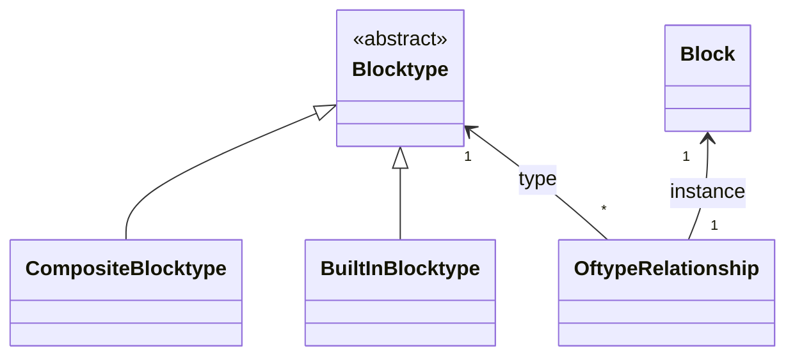
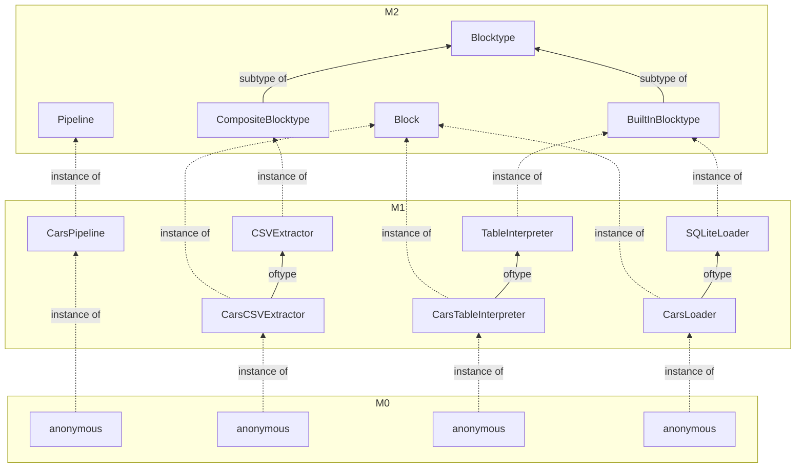
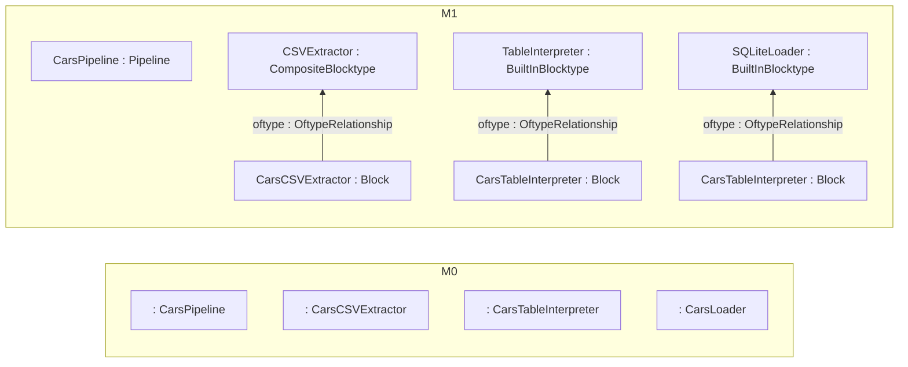

<!--
SPDX-FileCopyrightText: 2023 Friedrich-Alexander-Universitat Erlangen-Nurnberg

SPDX-License-Identifier: AGPL-3.0-only
-->

# RFC 0016: Block Instantiation Syntax

| | |
|---|---|
| Feature Tag | `block-instantiation-syntax` |
| Status | `ACCEPTED` | <!-- Possible values: DRAFT, DISCUSSION, ACCEPTED, REJECTED -->
| Responsible | `@rhazn` |
<!-- 
  Status Overview:
  - DRAFT: The RFC is not ready for a review and currently under change. Feel free to already ask for feedback on the structure and contents at this stage.
  - DISCUSSION: The RFC is open for discussion. Usually, we open a PR to trigger discussions.
  - ACCEPTED: The RFC was accepted. Create issues to prepare implementation of the RFC.
  - REJECTED: The RFC was rejected. If another revision emerges, switch to status DRAFT.
-->

## Summary
Following our [Design Principles](https://jvalue.github.io/jayvee/docs/dev/design-principles), Jayvee focuses on describing a goal state instead of how to get there. When creating pipelines, programmers use the pipe syntax `->` to connect previously defined `blocks`. Implicitely, the interpreter creates unnamed singleton instances of those blocks and executes them.

This implicit creation can lead to confusion between blocks and block instances. In addition, it makes it impossible to create more than one instance of a block, which will prevent the creation of more complex DAGs.

This RFC introduces minimal syntax changes to allow the creation of block instances, introduces more code structure and clarifies wording.

## Motivation
It is impossible to create multiple instances of the same block, limiting how complex a DAG can be described.

## Explanation

### Current state
#### M2 level (focused on blocks only)
Jayvee currently allows the instantiation of `composite blocktype`s, `builtin blocktype`s and `block`s. `block`s are connected to `blocktype`s by an `oftype` relationship.



#### An example model visualized
##### The model
```
pipeline CarsPipeline {
	CarsExtractor
	   	-> CarsTableInterpreter
		-> CarsLoader;

	block CarsCSVExtractor oftype CSVExtractor {
		url: "https://gist.githubusercontent.com/noamross/e5d3e859aa0c794be10b/raw/b999fb4425b54c63cab088c0ce2c0d6ce961a563/cars.csv";
	}

	block CarsTableInterpreter oftype TableInterpreter {
		header: true;
		columns: [
			"name" oftype text,
			"mpg" oftype decimal,
		];
	}

	block CarsLoader oftype SQLiteLoader {
		table: "Cars";
		file: "./cars.sqlite";
	}
}
```

##### As diagram including M2 level


##### As diagram excluding M2 level/instance of relationships


### Proposed changes
#### 1. Clarify naming
- Across M-levels, we have only a `instance of` relationship
- The only other currently possible relationship is the `oftype` relationship between a `block` and a `blocktype` on M1 level. Other relationships are not possible since they are not modelled at M2 level.
- Instantiation of M2 level concepts in M1 is done with language keywords
    - `composite blocktype <name>` / `builtin blocktype <name>`
- We keep `block` as M1 level keyword to instantiate the M2 level `Block`
- Users can describe M0 level entities in a Jayvee model
    - For blocks, we call these instances **"block instances"**
    - Pipes always connect block instances, never blocks

#### 2. Enable creating named block instances
- We introduce the following syntax
    - `<instance name> : <block>` models a block instance named `<instance name>` of `<block>`. For example: `myCarsCSVExtractor : CarsCSVExtractor` models an instance of the block `CarsCSVExtractor`, named `myCarsCSVExtractor`
    - ` : <block>` models an anonymous instance of `<block>`, reusing the same syntax creates a new instance
    - `<block>` models a singleton instance of `<block>`, reusing the same syntax reuses the same instance

#### 3. Allow only pipes and block instances in pipelines
The following explanations use blocks as an example but map directly to **Constraints** and **Valuetypes**. That is, constraints and valuetypes can also only be defined outside of pipelines and are instantiated inside of pipelines.

- Pipelines may only contain pipes and block instances, everything else has to be described outside of a pipeline

New syntax (minimal cars example):
```
// Pipeline containing block instantiations
pipeline CarsPipeline {
	myExtractor : CarsCSVExtractor 
    -> myInterpreter : CarsTableInterpreter
		-> myLoader : CarsLoader;
}

// Block definitions outside of pipeline
block CarsCSVExtractor oftype CSVExtractor {
  url: "https://gist.githubusercontent.com/noamross/e5d3e859aa0c794be10b/raw/b999fb4425b54c63cab088c0ce2c0d6ce961a563/cars.csv";
  enclosing: '"';
}
block CarsTableInterpreter oftype TableInterpreter {
  header: true;
  columns: [
    "mpg" oftype decimal,
    "cyl" oftype integer,
    "disp" oftype decimal,
  ];
}
block CarsLoader oftype SQLiteLoader {
  table: "Cars";
  file: "./cars.sqlite";
}
```

Composite blocks are a special case that use a smiliar pipe syntax to chain blocks. For the scope of this RFC, chaining pipeline syntax should **stay possible in pipelines and composite blocks** while **composite blocks are also able to contain block definitions**. In a future enhancement (see Possible Future Changes/Enhancements), this should be split up with the introduction of packages (ref [RFC0015](../0015-multi-file-jayvee/0015-multi-file-jayvee.md)).

#### 4. Allow only one DAG per pipeline
- If a user creates two graphs in one pipeline, the pipeline definition becomes invalid
  - A Jayvee model can contain more than one pipeline definition
  - All pipelines in a Jayvee model are instantiated and executed when the model is interpreted
```
// Valid pipeline
pipeline examplePipeline {
  A -> B -> C;
  B -> D;
}

// Invalid pipeline
pipeline examplePipeline {
  A -> B -> C;
  D -> E;
}

// Alternative to the invalid pipeline, create two pipelines
pipeline examplePipeline1 {
  A -> B -> C;
}
pipeline examplePipeline2 {
  D -> E;
}
```

## Drawbacks
- With additional enforced structure, users loose flexibility to define things where they want

## Alternatives
- Introduce explicit execution calls like `pipeline.execute();` or `instantiate <pipeline name>;`/`run <pipeline name>;` instead of implicitly executing pipelines
  - Decided against because Jayvee is purely declarative right now outside of expressions

## Possible Future Changes/Enhancements
- After implementing [RFC0015](../0015-multi-file-jayvee/0015-multi-file-jayvee.md), reconsider disallowing block definitions in composite blocks and instead enforce only chained pipelines in composite blocks and distribute them and their block definitions using packages instead.
- We consider constructors out of scope as of now, but save the following thoughts here for future reference
   - Constructors should always use named parameters, never parameter order
   - Constructor calls should be placed after the type, e.g., `<name> : <block>()` as in `myCarsCSVExtractor : CarsCSVExtractor()`
